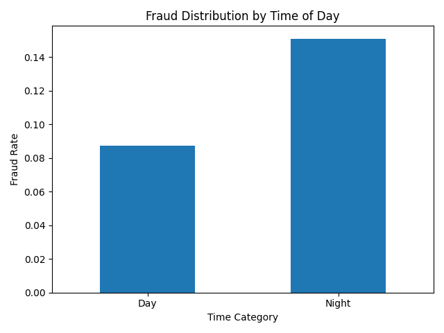
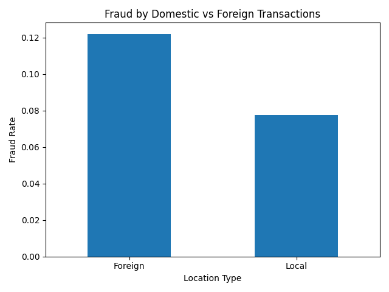

# AI Fraud Detection & Compliance System

This project demonstrates a generative AI-powered fraud detection system using synthetic financial transaction data. It simulates real-world fraud detection workflows and integrates compliance monitoring, anomaly detection, and ethical AI considerations.

---

## 🔍 Project Overview

- Generated synthetic transaction dataset  
- Built a fraud detection model  
- Integrated compliance workflow  
- Evaluated performance and accuracy  
- Visualized fraud patterns using behavioral data  

---

## 📊 Key Features

- Multi-variable fraud detection (amount, time, location)
- Behavioral anomaly detection
- Compliance-friendly workflow design
- Synthetic data generation for safe testing
- Visual insights for fraud trends

---

## 📊 Data Insights

### 🌙 Fraud by Time of Day

Fraud increases during nighttime transactions, indicating behavioral anomalies tied to reduced monitoring.

---

### 🌍 Fraud by Location

Foreign transactions show higher fraud rates, supporting geographic risk modeling.

---

## 🧠 Technologies Used

- Python (Pandas, NumPy, Scikit-learn)
- Synthetic Data Generation
- Data Visualization
- Machine Learning (Classification Models)

---

## ⚖️ Compliance & Ethics

- Human-in-the-loop review system  
- Bias monitoring and fairness checks  
- Data privacy preservation using synthetic data  
- Transparent and explainable model outputs  

---

## 🚀 Future Improvements

- Real-time fraud detection pipeline  
- Risk scoring system  
- Dashboard visualization  
- Integration with live transaction APIs  

---

## 📁 Files Included

- Dataset: `advanced_fraud_dataset.csv`  
- Charts: Fraud analysis visualizations  
- Report: Full project documentation  

---

## 👩‍💻 Author

Ruby Soto  
AI | Legal Studies | Cybersecurity | Governance
